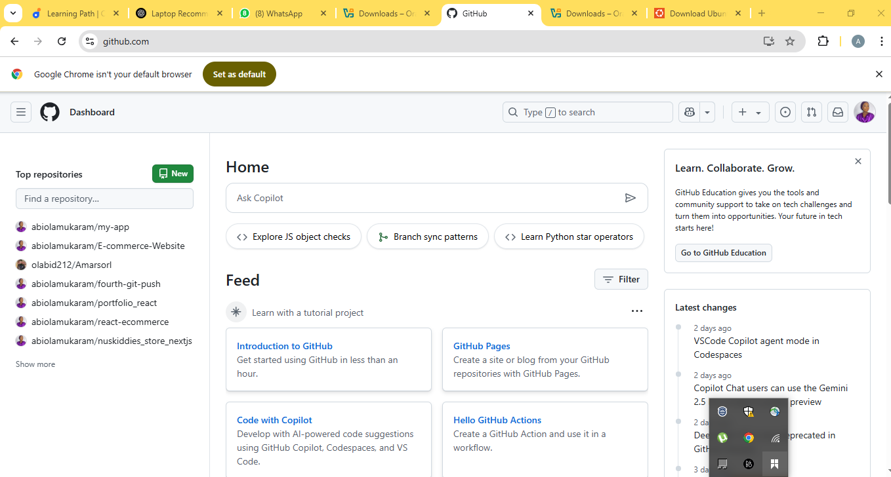

# tech_env_setup_project
>In this exercise, i installed tools such as VsCode, Git, Virtualbox and Ubuntu and created AWS and Github accounts. Find description and screenshot below.

## Tools Installed
1. VsCode
>VsCode

>Steps

* Go to [VsCode website](https://code.visualstudio.com/)
* Click "Download for windows" for windows and "MacOs" for apple laptops
* Locate the dowloaded .exe file, double click and follow the prompt to install
* After installation is completed, lauch VsCode.
>VsCode

2. Git

>Steps
- Go to [Git website](https://git-scm.com/downloads/win)
- click download, then double-click on the .exe file to install
- Launch Git
>Git

3. Virtualbox
> Steps
+ Ensure that Virtualization is enabled in your BIOs/UEFI
+ Go to [Virtualbox website](https://www.virtualbox.org/)
+ Click download, then double-click on the .exe file to install
+ Launch Virtualbox
>Virtualbox

4. Ubuntu
> Steps to install Ubuntu on Virtualbox
- Go to [Ubuntu website](https://ubuntu.com/download/desktop)
- Download the ISO file
- Launch Virtualbox and click on "New" to create a new virtual machine
- Configure the virtual machine
- Install Ubuntu
>Ubuntu

## Accounts Created

1. GitHub
> Steps
- Go to [GitHub website](https://github.com/)
- Click "Sign up" button and fill out the required information
- Verify your email
- Complete the CAPTCHA
- Choose a plan
>GitHub

2. AWS
> Steps
- Go to [AWS free tier page](https://aws.amazon.com/free/?all-free-tier.sort-by=item.additionalFields.SortRank&all-free-tier.sort-order=asc&awsf.Free%20Tier%20Types=*all&awsf.Free%20Tier%20Categories=*all)
- Click "create an AWS account" to create an account
- Provide account information
- Verify your account
- Choose a support plan
- Enter payment information
- Wait for approval
- Access the AWS management console
>AWS

